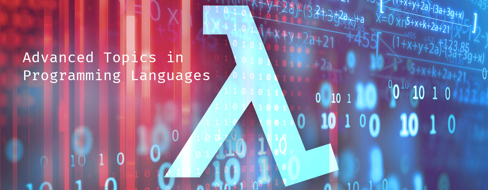

# COMSM0066: Advanced Topics in Programming Languages 2021/22

[Staff](Staff.md) | [Assessment](Assessment.md) | [Structure](Structure.md) | [Problem Classes](ProblemClasses.md) | [Schedule](Schedule.md) | [Content](Content.md)

Advanced Topics in Programming Languages is a fourth year optional unit at the University of Bristol. We will give you a grounding in the field of Programming Languages, along with an insight into what it is like to be Programming Languages researcher.

The unit will be based on the Robert Harper book: [Practical Foundations for Programming
Languages](http://profs.sci.univr.it/~merro/files/harper.pdf).

You can also find out more about Programming Languages at Bristol [here](https://bristolpl.github.io/).

Links:
[Teams](https://teams.microsoft.com/l/team/19%3aYLl8cZ1LVsO2bu8XXjE8QTc7WUPHgPZGzPmXUGdID-k1%40thread.tacv2/conversations?groupId=68f87e2e-dfc5-48c2-b267-49f1769e1c29&tenantId=b2e47f30-cd7d-4a4e-a5da-b18cf1a4151b)
| [Blackboard](TODO)
